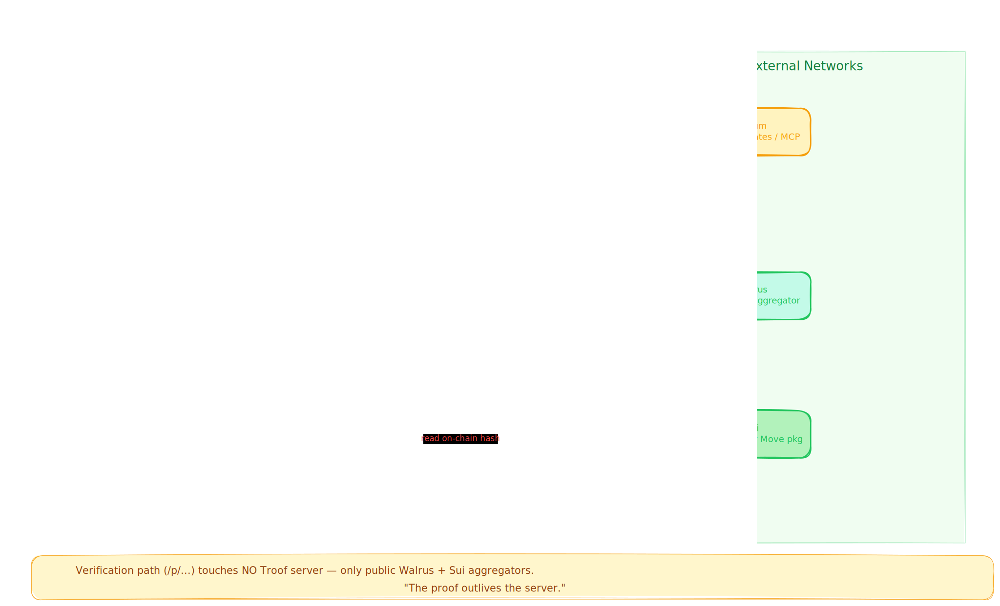
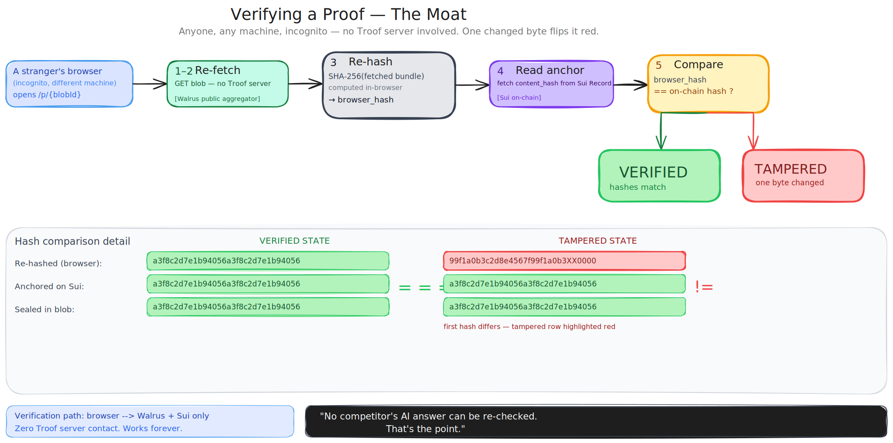
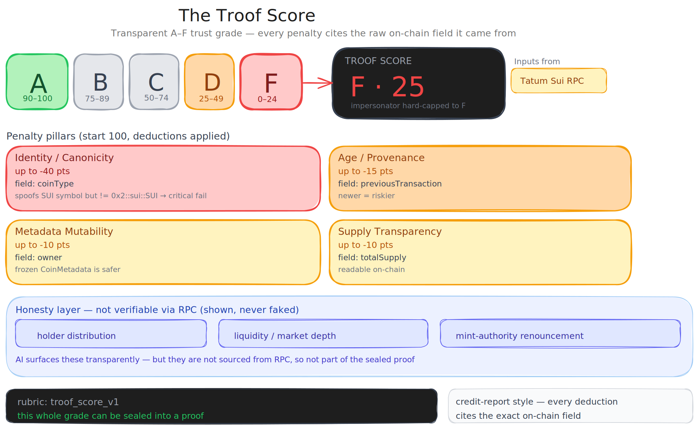

<div align="center">


# Troof

### The AI explorer for Sui — that can prove its answers.

Ask an AI about any Sui **wallet, token, or transaction** in plain English. It reads the chain live through Tatum and explains it — and any answer can be **sealed into a proof a stranger can re-fetch and re-hash** to `Verified` or `Tampered`.

*Powered by [Tatum](https://tatum.io) · [Walrus](https://walrus.xyz) · [Sui](https://sui.io). Built for the Tatum × Walrus on Sui hackathon.*

</div>

---

> Most explorers hand you raw data; an AI explorer explains it. Troof goes one step further: any answer can be **sealed so anyone can independently re-check it wasn't altered** — the answer, the on-chain data behind it, and the verdict are stored on Walrus and anchored on Sui, with no Troof server in the verification path.



## Demo

- 60-sec overview: `docs/videos/overview.mp4` *(coming)*
- Spot a fake SUI, seal it, then flip it to tampered: `docs/videos/troof-score.mp4` *(coming)*
- Verify a proof on another machine: `docs/videos/verify.mp4` *(coming)*

**Live:** https://troof.site · **Sample proof:** `/p/<blobId>` (re-hydrates from a public Walrus aggregator and checks its on-chain anchor)

## What it does

1. **Ask.** Paste a Sui wallet, token, or **transaction** into the terminal. An AI agent reads it live through **Tatum** (Sui RPC + the Tatum MCP server) and explains it in plain English — a wallet's holdings, a token's trustworthiness, or what a transaction actually did.
2. **Grade.** Wallets get an integrity-checked report (USD is shown only for canonical `0x2::sui::SUI`, so tokens faking the SUI symbol can't inflate it). Tokens get a **Troof Score** (A to F), and every penalty points at the raw on-chain field it came from.
3. **Seal.** One click writes the full evidence bundle to **Walrus** and anchors its **SHA-256 on Sui**.
4. **Verify.** Open the proof link anywhere. It re-fetches from a **public Walrus aggregator**, re-hashes **in your browser**, and compares to the on-chain record: `Verified` (green), or `Tampered` (red) if a single byte changed.



## The Troof Score

A plain A-to-F trust grade for a Sui coin, built only from on-chain signals: canonicity (faking the SUI symbol is a hard fail), age, metadata mutability, and supply transparency. Things we can't check on-chain (holders, liquidity) are shown honestly, never faked. The whole score can be sealed too.



## How we used Walrus

The proof is a Walrus blob. Remove Walrus and it's just a forgeable screenshot.

- The sealed bundle (report + AI verdict + Troof Score) is stored via the Walrus HTTP publisher (`PUT /v1/blobs`).
- Verification re-fetches it from a public aggregator (`GET /v1/blobs/{id}`), reconstructed from storage-node slivers with no server of ours involved.
- The blob id is content-derived, so the share URL itself can't point at swapped bytes.

## How we used Tatum

Tatum is the only node provider and the data engine.

- **Sui RPC gateway** (11 methods: balances, owned objects, stakes, tx history, coin metadata, total supply, object reads, name service, gas, anchor read-back), all proxied server-side so the key never reaches the client.
- **Exchange-Rate Data API** for USD valuation of canonical SUI.
- **Tatum MCP server** (13 tools) drives the AI agent over stdio.
- The on-chain anchor transaction is itself submitted through the Tatum gateway.

Honest note: Tatum's high-level wallet/portfolio Data API and its Malicious-Address API don't cover Sui, so Sui data comes from RPC, and our canonical-coin-type impersonator check is the Sui-native substitute for address screening.

## Roadmap and extras

- **Troof API (x402):** the analyze / score / verify endpoints as pay-per-call HTTP APIs over the [x402](https://x402.org) protocol. See [`docs/x402.md`](docs/x402.md).
- More architecture diagrams in [`docs/diagrams/`](docs/diagrams); the agent + MCP flow and seal flow are in [`public/docs/`](public/docs).

## Tech stack

Next.js 16 · React 19 · TypeScript · Tailwind v4 + shadcn/ui · AI SDK v6 (Claude Haiku/Sonnet) · `@modelcontextprotocol/sdk` · `@mysten/sui` + `@mysten/dapp-kit` · Walrus HTTP API · Sui Move.

## Run locally

```bash
pnpm install
cp .env.example .env.local   # add TATUM_API_KEY + ANTHROPIC_API_KEY
node --env-file=.env.local scripts/deploy-anchor.mjs   # publish the anchor package (testnet) + fund the signer
pnpm dev
```

Integration smoke test: `node --env-file=.env.local scripts/smoke-test.mjs`

## License

MIT
